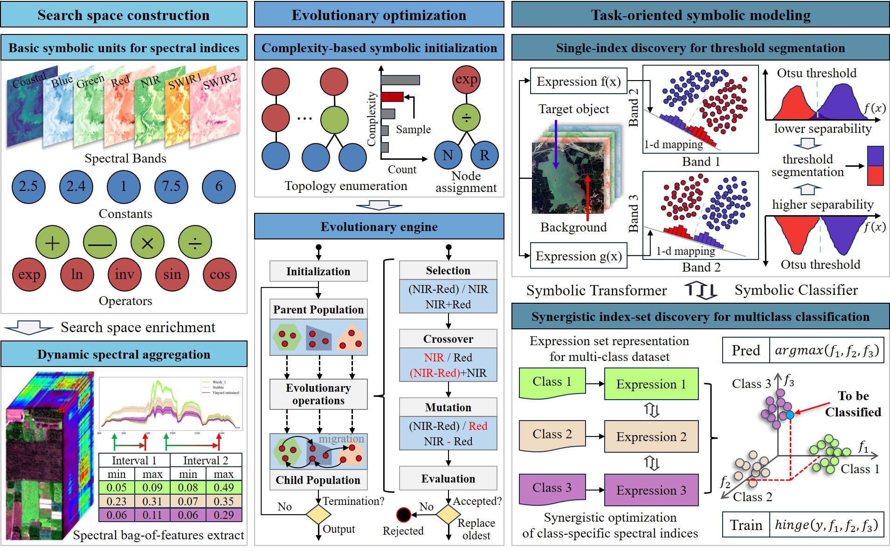
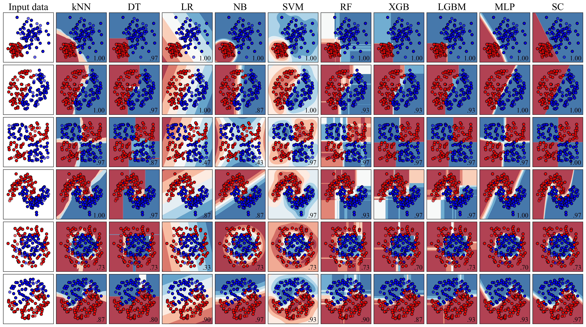

# **Symbolic Discovery of Explicit and Auditable Spectral Models for Land Cover Mapping**

 

**Authors:** [Junwu Dong](https://orcid.org/0000-0003-4226-5042), [Tao Pei](https://orcid.org/0000-0002-5311-8761), [Ci Song](https://orcid.org/0000-0003-2146-6259), [Xi Wang](https://orcid.org/0000-0003-1859-9958), [Yahui Qi](https://orcid.org/0000-0002-7927-7605), [Dayu Cheng](https://orcid.org/0009-0006-5483-1274), and Yanmin Jiang

> 📄 **Accepted for publication in** *IEEE Transactions on Geoscience and Remote Sensing* (2026). DOI: [10.1109/TGRS.2026.3731741](https://doi.org/10.1109/TGRS.2026.3731741) (to be activated upon official publication)

---

This repository provides the official implementation of the paper:

**"Symbolic Discovery of Explicit and Auditable Spectral Models for Land Cover Mapping."**

The code implements our data-driven symbolic learning framework for discovering explicit and auditable spectral models—class-specific spectral indices—that support both single-index threshold segmentation and multiclass land-cover classification.





---

## ⭐ Features

- End-to-end symbolic discovery framework based on genetic programming
- Explicit and auditable class-specific spectral indices with full interpretability
- **Dynamic Spectral Aggregation Terminals (DSATs)** — terminal nodes that aggregate adjacent spectral bands on demand
- **Complexity-guided population initialization** — seeds the initial population with expressions spanning a wide range of structural complexity
- **Hinge Loss-based expression-set optimization** — jointly optimizes a set of expressions, a key distinguishing feature of this algorithm that enables coherent multiclass discrimination
- Support for both multispectral and hyperspectral datasets

### 🔧 Evolutionary Engine

The GP engine is inspired by [SymbolicRegression.jl](https://github.com/astroautomata/SymbolicRegression.jl) and shares many of its design characteristics (e.g., typed function sets, hall-of-fame archiving). The key novel contributions over that baseline are:

- **DSATs**: terminals that adaptively aggregate neighboring spectral channels, enabling the discovery of indices that would be impractical to express with raw bands alone
- **Complexity-guided initialization**: seeds the population across the full spectrum of expression complexity, improving exploration without sacrificing diversity

Performance is lower than a compiled Julia implementation, but the NumPy/Numba backend provides reasonable speed for datasets of typical size.

---

## 📦 Installation

```bash
pip install -e .                    # development (editable)
```

The core library requires NumPy, pandas, scipy, scikit-learn, joblib, tqdm, and
Numba (used by `node.py`, `fitness.py`, and `symbolearn/metrics/` for JIT
acceleration). There is no non-Numba fallback path — Numba is mandatory for
this codebase, but its install footprint is small and the JIT compile cost is
amortized after the first call to each fitness function.

---

## 🚀 Quick Start

```python
from sklearn.datasets import make_classification
from sklearn.model_selection import train_test_split
from symbolearn import SymbolicClassifier, SymbolicRegressor

X, y = make_classification(n_samples=1000, n_features=20, random_state=42)
X_train, X_test, y_train, y_test = train_test_split(X, y, test_size=0.3, random_state=42)

model = SymbolicClassifier(
    maxsize=15,
    niterations=10,
    populations=31,
    population_size=27,
    ncycles_per_iteration=38, 
    n_jobs=8, verbose=1, random_state=42
)
model.fit(X_train, y_train)
print(f"Test Accuracy: {model.score(X_test, y_test):.4f}")
print(f"Best expression: \n{model.get_best()}")
```

For a full walkthrough, see [`example.ipynb`](./example.ipynb).

---

## 📁 Dataset

### Included datasets

The repository includes example datasets under `./example_data`:

- **Poyang Lake dataset**
- **Multiclass-L8 dataset**

### External hyperspectral datasets

The hyperspectral datasets used in the paper (e.g., **Pavia University**, **Salinas**) can be downloaded from:

👉 [Hyperspectral_Image_Datasets_Collection](https://github.com/Sellifake/Hyperspectral_Image_Datasets_Collection)

Due to data size limitations, a preview of the Pavia University dataset is included in:

```
./example_data/hyperspectral
```

---

## 📂 Repository Structure

```
.
├── example_data/               # Example multispectral & hyperspectral data
├── figs/                       # Figures and diagrams used in README/paper
├── symbolearn/                 # Core implementation
│   ├── __init__.py             # Public API exports (SymbolicClassifier, etc.)
│   ├── base.py                 # Base estimator class
│   ├── expression.py           # Expression and ExpressionSet (chromosome) representation
│   ├── fitness.py              # Fitness evaluation
│   ├── generator.py            # Expression generator (complexity-guided)
│   ├── gpoperator.py           # GP operators (crossover, mutation, selection)
│   ├── halloffame.py           # Hall-of-fame archiving
│   ├── log.py                  # Logging utilities
│   ├── metrics/                # Metric functions (classification, regression, transformer)
│   ├── node.py                 # Node representation
│   ├── population.py           # Population management
│   ├── symbolic_estimators.py  # High-level Estimator API
│   ├── tree.py                 # Tree representation
│   ├── tree_parser.py          # String-to-tree parser
│   └── utils.py                # Utility functions
├── tests/                      # Unit tests
├── example.ipynb               # Main demo notebook
├── train_sc.py                 # Training script for hyperspectral classification
├── test.py                     # Lightweight smoke test
├── pyproject.toml              # Package configuration & dependencies
└── README.md
```

---

## 📧 Contact

If you have questions or encounter issues, feel free to contact:

**Junwu Dong**
Email: *[djw@lreis.ac.cn](mailto:djw@lreis.ac.cn)*

---

## 📚 Citation

If you use this code in your research, please cite our paper:

> Junwu Dong, Tao Pei, Ci Song, Xi Wang, Yahui Qi, Dayu Cheng, and Yanmin Jiang, "Symbolic Discovery of Explicit and Auditable Spectral Models for Land Cover Mapping," *IEEE Transactions on Geoscience and Remote Sensing*, 2026. doi: [10.1109/TGRS.2026.3731741](https://doi.org/10.1109/TGRS.2026.3731741)

BibTeX:

```bibtex
@article{dong2026symbolic,
  author  = {Junwu Dong and Tao Pei and Ci Song and Xi Wang and Yahui Qi and Dayu Cheng and Yanmin Jiang},
  title   = {Symbolic Discovery of Explicit and Auditable Spectral Models for Land Cover Mapping},
  journal = {IEEE Transactions on Geoscience and Remote Sensing},
  year    = {2026},
  note    = {Accepted for publication, to appear},
  doi     = {10.1109/TGRS.2026.3731741}
}
```

---

## 📄 License

This project is released under an academic-use license — see the [`LICENSE`](./LICENSE)
file in this repository for the full terms. In short:

- Free for academic research and educational use, with attribution to the
  IEEE TGRS paper below.
- Commercial use requires prior written permission from the corresponding
  author (`djw@lreis.ac.cn`).

A machine-readable citation for GitHub's "Cite this repository" feature is
provided in [`CITATION.cff`](./CITATION.cff).
